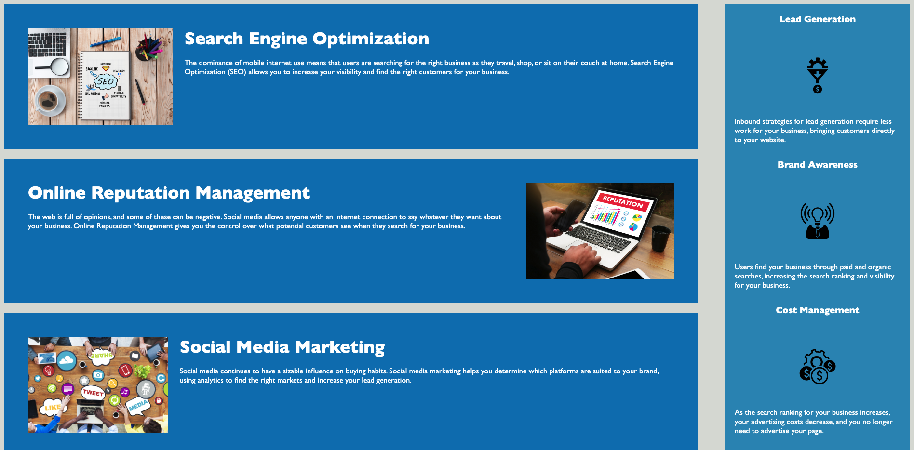
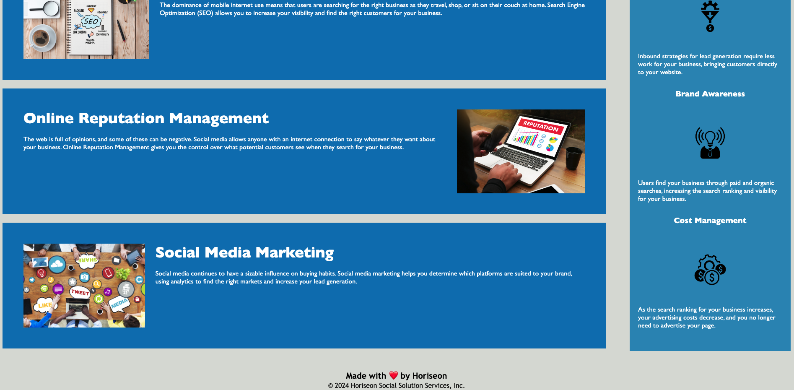

# Challenge-1

## Description

My motivation behind this whole assignment was to learn how to refactor code and improve a webpages accessibilty standards. I learned how to refactor existing code without changing funtionality to meet requirements. I optimizied this project to have more Semantic HTML elements, also to follow a logical structure of styling and position. Also added alt attributes to the images and gave the project a proper title to fit the project standards. The problems on this project had to do with the lack of semantic HTML and the duplicated CSS selectors and properties. Therefore, I made changes that made the codebase more accessible by adding more semantic HTML and reduced the duplicated CSS selectors and properties. I learned that refactoring code can improve my ability to write code, understand code, and improve the quality of the code by making it more concise and easier to understand.

## Screenshot

## Credits
[w3schools](https://www.w3schools.com/css)

[MdnWebDocs](https://developer.mozilla.org/en-US/docs/Learn/CSS)

## Links
[GithubRepoLink](https://github.com/PengsueT/Challenge-1.git)
